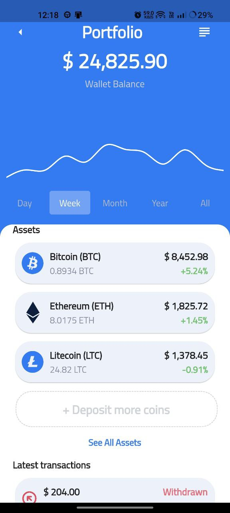

# Crypto Wallet App

The Crypto Wallet App is a Flutter application designed to provide a seamless and user-friendly experience for managing your cryptocurrencies. Whether you're a seasoned investor or just starting with crypto, this app makes it easy to send, receive, and track your digital assets.

## Features

- **Easy Transactions:** Send and receive cryptocurrencies with just a few taps. The app provides a simple and intuitive interface for hassle-free transactions.

- **Quick Overview:** Get a quick overview of your cryptocurrency portfolio. Track the value of your assets in real-time and stay informed about market trends.

- **Secure and Private:** Your security is our priority. The app ensures the safety of your transactions and keeps your financial data private.

- **User-Friendly Interface:** Designed with the user in mind, the app offers a clean and user-friendly interface, making it easy for anyone to navigate and use.

## Screenshots

  
  
  

  
  
  

  
  
  

  
  <!-- Add more screenshots as needed -->

